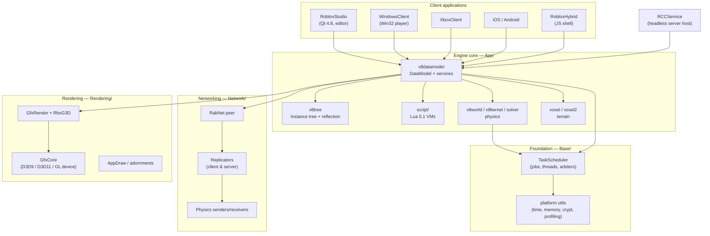

# Architecture overview

This chapter explains how the engine fits together. Each page covers one subsystem; together
they describe the whole stack from the `Instance` base class down to the pixels and packets.

## The big picture

## Design principles of the 2016 engine

1. **Everything is an `Instance`.** The scene, the GUI, the services, the scripts — all objects
   derive from `RBX::Instance` and live in one tree rooted at the `DataModel`.
   ([Instance tree & reflection](./instance-tree.md))
2. **Reflection drives both the editor and Lua.** Properties, methods and events are described
   once via reflection descriptors; Studio property grids, XML/binary serialization and the Lua
   API are all generated from that single source of truth.
   ([Scripting](./scripting.md), [Reflection](./instance-tree.md#the-reflection-system))
3. **The DataModel is a scheduled, mostly single-threaded world.** Work runs as *Jobs* on a
   central `TaskScheduler`; an *Arbiter* system decides which jobs may run concurrently
   (rendering and physics overlap; DataModel mutation does not).
   ([Jobs & the TaskScheduler](./jobs-and-scheduler.md))
4. **Clients and servers share the same engine.** `RCCService` runs the identical `App` engine
   headless; the `Network/` stack replicates Instance-tree changes between peers with
   specialized channels for physics. ([Networking](./network.md))
5. **Rendering is layered.** Device abstraction (`GfxCore`) under scene rendering
   (`GfxRender`, `RbxG3D` on G3D math) under engine draw code (`AppDraw`, adornments), with
   multiple backends: D3D9, D3D11, OpenGL. ([Rendering](./rendering.md))

## Chapter contents

1. [Instance tree & reflection](./instance-tree.md) — `RBX::Instance`, descriptors, services
2. [The DataModel](./datamodel.md) — services, parts, GUI, gameplay instances
3. [Jobs & the TaskScheduler](./jobs-and-scheduler.md) — threading model
4. [Scripting (Lua)](./scripting.md) — VMs, bridges, CoreScripts, security
5. [Physics](./physics.md) — world, kernel, solver, humanoids, Bullet
6. [Rendering](./rendering.md) — graphics stack and backends
7. [Networking](./network.md) — RakNet, replication, physics sync
8. [Serialization](./serialization.md) — XML/binary place & model formats
9. [Terrain & CSG](./terrain-and-csg.md) — voxels, smooth terrain, boolean geometry

Each subsystem has a matching deep-dive in the [Module Reference](../modules/index.md).
