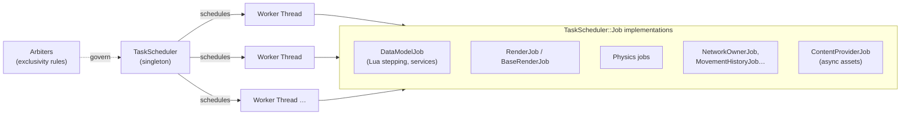

# Jobs & the TaskScheduler

*Where:* `Base/include/rbx/TaskScheduler.h`, `Base/rbx/TaskScheduler*.cpp`,
`App/v8datamodel/DataModelJob.cpp`, `Rendering/GfxBase/BaseRenderJob.cpp`, …

The 2016 engine replaced a naive main loop with a **job-based scheduler**: all recurring work is
expressed as `TaskScheduler::Job` objects that a central singleton (`RBX::TaskScheduler`)
executes on a pool of worker `Thread`s (`Base/rbx/TaskScheduler.Thread.cpp`).



## The scheduler

From `Base/include/rbx/TaskScheduler.h`:

- **`TaskScheduler`** — *"A singleton object responsible for scheduling the execution
  TaskScheduler.Jobs."* It keeps sleeping/waiting intrusive lists of jobs and implements a
  **cyclic executive** mode (fixed frame cadence — `cyclicExecutiveLoopId`,
  `cyclicExecutiveWaitForNextFrame`, `DataModel30fpsThrottle`) alongside best-effort
  non-cyclic jobs.
- **`TaskScheduler::Job`** (`Base/rbx/TaskScheduler.Job.cpp`) — unit of recurring work with
  its own timing, priority and sleep logic.
- **`TaskScheduler::Thread`** — worker threads that pull runnable jobs.

## Arbiters

The interesting part is `TaskScheduler::Arbiter`:

```cpp
class Arbiter {
    virtual std::string arbiterName() = 0;
    virtual bool areExclusive(Job* job1, Job* job2) = 0;
    virtual bool isThrottled() = 0;
    ...
};
```

An **arbiter** declares that two jobs must *never* run at the same time (for example: two jobs
that both need to mutate the DataModel). This is how the engine gets parallelism between
rendering, physics and networking *without* letting anything corrupt shared state — instead of
one global lock, exclusivity is declared per job pair and tracked with activity meters
(`ActivityMeter`), which also powers job-profiling statistics.

## The important jobs

| Job | File | Role |
| --- | --- | --- |
| `DataModelJob` | `App/v8datamodel/DataModelJob.cpp` | Steps the DataModel: scripts (Heartbeat & co.), services, simulation steps |
| `BaseRenderJob` / `RenderJob` | `App/v8datamodel/BaseRenderJob.cpp`, `WindowsClient/RenderJob.cpp` | Frames the render pipeline (see [Rendering](./rendering.md)) |
| Physics stepping | `App/v8world/*Stage.cpp`, kernel stages | World simulation (see [Physics](./physics.md)) |
| `ContentProviderJob` | `App/util/ContentProviderJob.cpp` | Background asset downloads |
| `NetworkOwnerJob` | `Network/NetworkOwnerJob.cpp` | Recomputes network ownership of assemblies |
| `MovementHistoryJob` | `Network/MovementHistoryJob.cpp` | Records physics movement history for replication |
| `GamePerfMonitor` | `Network/GamePerfMonitor.cpp` | Performance counters for the server |

## Profiling & observation

`Base/rbx/Profiler.cpp`, `ProcessPerfCounter.cpp` plus the `ActivityMeter` on arbiters feed the
in-engine profiling surfaces (`RenderStats`, microprofile-style tooling; the roadmap lists
"advanced profiling tools" as a future enhancement).
