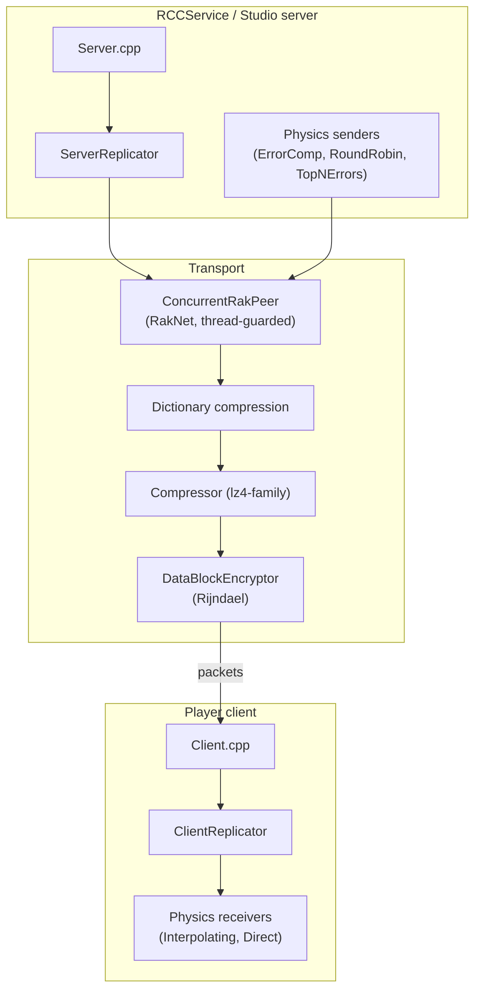

# Networking

*Where:* `Network/` (RakNet itself is vendored in `Network/raknet/`)

The networking stack is built on **RakNet** (UDP) and implements the Roblox replication model:
one authoritative server, clients that join a place, and continuous synchronization of the
Instance tree plus physics.

## Topology & peers

- **`Peer.cpp` / `Peer.h`** — base peer abstraction.
- **`ConcurrentRakPeer`** — wraps `RakNet::RakPeerInterface` in a thread-safe guard so the
  network thread and the DataModel thread can both touch it (this is the era's RakNet version;
  sources in `Network/raknet/Source` with `Lib` and `Samples`).
- **`Server.cpp` / `Client.cpp`** — listen/connect logic, connection lifecycle.
- **`GameConfigurer.cpp`** — assembles the network stack for a game session.
- **`PacketIds.h`** — the protocol's packet identifiers.

## Replication of the Instance tree

- **`Replicator.cpp`** (+ `Replicator.TagItem.cpp`) — the core: creates/removes instances,
  sends property changes, parenting, and "tag items" as deltas.
- **`ServerReplicator.cpp` / `ClientReplicator.cpp`** — the two halves of the protocol.
- **`Item.cpp`**, **`MechanismItem.cpp`**, **`Marker.cpp`** — replicated payload units
  (instances, physics mechanisms, joins/leaves).
- **`NetworkClusterPacketCache.cpp` / `NetworkPacketCache.cpp` / `ClusterUpdateBuffer.cpp`** —
  packet caches & batching for cluster (terrain/many-part) updates.
- **`Streaming.cpp` / `StreamingUtil.h`** — region streaming behavior of the era.
- **`ReplicatorStats.cpp` / `NetworkProfiler.cpp`** — instrumentation.

## Physics synchronization

Dedicated channels keep simulated parts in sync without replicating every step:

| Component | Direction | Strategy |
| --- | --- | --- |
| `PhysicsSender.cpp` | server → client | Base sender |
| `ErrorCompPhysicsSender.cpp` / `ErrorCompPhysicsSender2.cpp` | server → client | **Error compensation** — sends corrections sized by divergence |
| `RoundRobinPhysicsSender.cpp` | server → client | Fair round-robin over assemblies |
| `TopNErrorsPhysicsSender.cpp` | server → client | Prioritizes the *N* worst-diverging assemblies |
| `PhysicsReceiver.cpp` | client ← server | Base receiver |
| `InterpolatingPhysicsReceiver.cpp` | client ← server | Smooths corrections |
| `DirectPhysicsReceiver.cpp` | client ← server | Applies state directly (owned objects) |
| `NetworkOwnerJob.cpp` | both | Computes which peer *owns* (simulates) each assembly |
| `MovementHistoryJob.cpp` | server | Buffers movement history for rewind/replay |

## Auxiliary systems

- **Chat filtering** — `ChatFilter.cpp`, `WebChatFilter.cpp` (server-side and web-service
  based), see also `App/gui/ProfanityFilter.cpp` and `App/util/KeywordFilter.cpp`.
- **Persistence** — `PersistentDataStore.cpp` (DataStore service traffic),
  `GuidRegistryService.cpp` (asset GUID registry).
- **Web API** — `API.cpp` (plus `App/util/HttpAsync.cpp`, `AsyncHttpQueue.cpp`, curl under
  `Library/curl`).
- **Security** — `DataBlockEncryptor.cpp` with vendored **Rijndael** (`rijndael.cpp`,
  `Rijndael-Boxes.h`), `NetPmc.cpp`, and `CrashReporter.cpp`.
- **Settings & monitoring** — `NetworkSettings.cpp`, `GamePerfMonitor.cpp`,
  `NetworkFilter.cpp` (address/traffic filtering).
- **`BoostAppend.cpp`** — compatibility shims over the bundled Boost.Asio/cpp-netlib.

## RCCService — the server side

`RCCService/` is the headless **Roblox Cloud Compute** service that hosted games on real
Roblox infrastructure: it runs the same `App` engine without UI (see
[Module: RCCService](../modules/rcc.md) and the C# `Roblox.RccServiceArbiter`). Clients join an
RCC-hosted server through the replication protocol above; `WindowsClient/Teleporter.cpp`
implements the era's "teleport" (server hop) flow.
