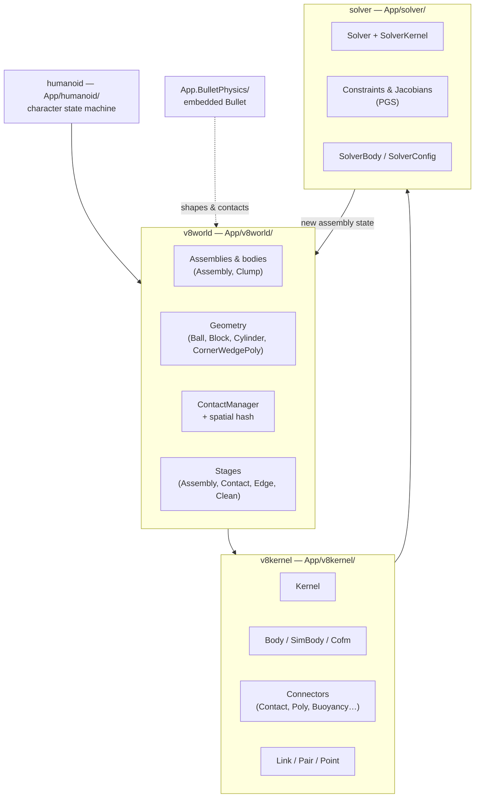

# Physics

*Where:* `App/v8world/`, `App/v8kernel/`, `App/solver/`, `App/humanoid/`, `App.BulletPhysics/`

Physics in the 2016 engine is a homegrown simulation stack ("v8" world) with an embedded
**Bullet Physics** library for specialized collision shapes, plus a character controller built
as a state machine.

## The world (`App/v8world/`)

The world owns the physical scene:

- **Assemblies** — groups of parts connected by joints simulated as a rigid unit
  (`Assembly.cpp`, `AssemblyHistory.cpp` for network rewind, `Clump.cpp`).
- **Geometry primitives** — `Ball`, `Block`, `Cylinder`, `CornerWedgePoly` — and terrain-cell
  collision.
- **Contacts** — `ContactManager` (with a spatial-hash broadphase,
  `ContactManagerSpatialHash.cpp`) tracks collisions between primitives
  (`CellContact`, `BallCellContact`, `BallPolyContact`, `Edge`).
- **Staged simulation** — the world advances in stages: `AssemblyStage`, `ContactStage`,
  `EdgeStage`, `CleanStage` — each stage is schedulable work for the
  [TaskScheduler](./jobs-and-scheduler.md).
- **Joints & mechanisms** — `GlueJoint`, `Controller`; `Network/` simulates mechanisms
  remotely (`MechanismItem.cpp`).
- **Buoyancy** — `Buoyancy.cpp` implements swimming/water forces (the fork uncapped
  `WaterWaveSize`/`WaterWaveSpeed`, see [Project Status](../getting-started/project-status.md)).

## The kernel (`App/v8kernel/`)

The kernel is the low-level simulation core: `Kernel.cpp` orchestrates; `Body`/`SimBody` are
rigid bodies with computed center of mass (`Cofm.cpp`); `Connector` and its subclasses
(`ContactConnector`, `PolyConnectors`, `BuoyancyConnector`, `BulletShapeConnectors`) feed
forces and impulses between bodies; `Link`, `Pair`, `Point` model constraints and contact
points; `Constants.cpp` holds simulation constants.

## The solver (`App/solver/`)

The constraint solver — this is the era where Roblox shipped its **PGS** (Projected
Gauss–Seidel) solver alongside the classic engine:

- `Solver.cpp` + `SolverKernel.cpp` — the solving loop
- `Constraint.cpp`, `ConstraintJacobian.cpp` — constraints expressed with Jacobians
- `SolverBody.cpp`, `SolverConfig.cpp` — per-body solver state & configuration

The `RobloxTest/PGS/` suite covers it (see [Testing](../modules/testing.md)).

## Bullet Physics (`App.BulletPhysics/`)

A vendored **Bullet Physics** distribution: `BulletCollision`, `BulletDynamics`,
`BulletMultiThreaded`, `BulletSoftBody`, `MiniCL`, `LinearMath`, `vectormath`, plus the C API
(`Bullet-C-Api.h`). The engine uses it for advanced shape collision — `v8world` has dedicated
`BulletContact`, `BulletShapeContact`, `BulletShapeCellContact` and a geometry pool
(`BulletGeometryPoolObjects.cpp`). Upgrading Bullet is on the roadmap
(see [Roadmap](../reference/roadmap.md#physics)).

## Humanoids (`App/humanoid/`) {#humanoids}

`Humanoid.cpp` is the character controller; behavior is a **state machine** with one file per
state:

`HumanoidState` (base) · `Running`/`RunningBase`/`RunningNoPhysics` · `Jumping` · `Freefall` ·
`FallingDown` · `GettingUp` · `Flying` · `Swimming` · `Seated` · `Climbing`-era `MovingNoPhysicsBase`/`StrafingNoPhysics` · `Balancing` · `Ragdoll`

`StatusInstance.cpp` models health/state HUD data. Planned improvements
(`Humanoid.FloorMaterial`, ragdoll systems) are on the roadmap.

## Simulation flavors

`RobloxTest/` hints at the supported configurations: `BulletPhysicsTests`,
`BulletPhysicsOffTests`, `DPhysicsTests`, `PGS`, `PhysicsQuickTests`, `PhysicsTestsLong`,
`UnstablePhysicsTests` — the engine can run with/without Bullet and with either solver
lineage.
