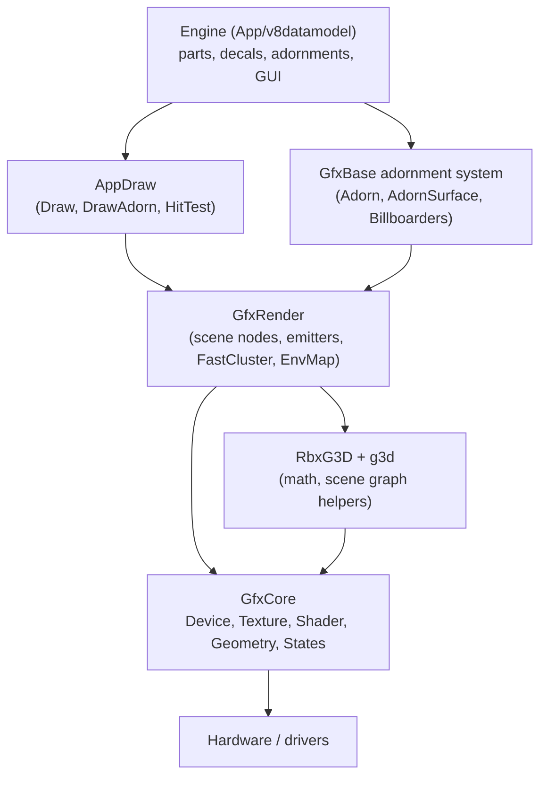

# Rendering

*Where:* `Rendering/` — subprojects `GfxBase`, `GfxCore`, `GfxRender`, `RbxG3D`, `g3d`,
`AppDraw`, `ShaderCompiler`, plus VR SDKs `LibOVR`, `OpenVR`, `VrApi`.

Rendering is layered: a thin device abstraction at the bottom, scene rendering in the middle,
engine draw code at the top.

## GfxBase — the engine-side foundation

`Rendering/GfxBase/`: types the *engine* talks to, independent of the actual graphics API.

| File | Role |
| --- | --- |
| `ViewBase.cpp` | Base view — render job inputs (viewport, camera) |
| `Adorn.cpp`, `AdornSurface.cpp`, `AdornBillboarder.cpp`, `AdornBillboarder2D.cpp`, `ViewportBillboarder.cpp` | The **adornment** system — wireframes, selection boxes, billboards, 2D overlays |
| `IAdornableCollector.cpp` | Collects adornables for a frame |
| `GfxPart.cpp` | Renderable part proxy |
| `RenderCaps.cpp` | Hardware capability detection |
| `RenderSettings.cpp`, `RenderStats.cpp` | Quality settings & frame statistics |
| `FrameRateManager.cpp` | FPS throttling/management |
| `FileMeshData.cpp` | Mesh data loading |
| `PartIdentifier.cpp` | Per-part identification for batching |

## GfxCore — the device layer

`Rendering/GfxCore/` wraps the actual graphics APIs behind one interface:

- `Device.cpp`, `DeviceCreate.cpp` — device creation & management
- Backend implementations in **`D3D9/`**, **`D3D11/`** and **`GL/`** (with `nglew` for the
  OpenGL extension wrangler)
- `Texture.cpp`, `Shader.cpp`, `Geometry.cpp`, `Framebuffer.cpp`, `States.cpp`,
  `Resource.cpp` — resources of each type, per backend
- `pix.cpp` — PIX profiling instrumentation hooks (DirectX)

:::warning Backend status in this fork

Per the README: the **D3D9** path works (a suspected text-render bug turned out to never have
existed), while **D3D11 does not initialize** yet. Modern backends (D3D12/Vulkan) are on the
[roadmap](../reference/roadmap.md#graphics--rendering). OpenGL is the Unix/mobile path.

:::

## GfxRender — the scene renderer

`Rendering/GfxRender/` turns the DataModel into draw calls:

- `CullableSceneNode.cpp` — culling hierarchy
- `FastCluster.cpp` — the part-cluster fast path (terrain/many parts)
- `GeometryGenerator.cpp` — procedural geometry (wedges, cylinders…)
- Particle/effect emitters: `Emitter.cpp`, `CustomEmitter.cpp`, `ExplosionEmitter.cpp`
- `EnvMap.cpp` — environment/sky reflection mapping
- `AdornRender.cpp` — renders the adornment stream

## RbxG3D and g3d

`Rendering/g3d/` is **G3D** (Grimshaw's Graphics3D), the graphics math/scene library the 2010s
engine leaned on (vectors, matrices, `G3DCore.h` compatibility in `App/util`).
`Rendering/RbxG3D/` is the Roblox integration layer on top of it. (The `graphics3D` and
`RbxG3D` projects are both on the "builds" list.)

## AppDraw — engine → renderer glue

`Rendering/AppDraw/` (`Draw.cpp`, `DrawAdorn.cpp`, `HitTest.cpp`, headers in `include/`)
implements how engine primitives actually get drawn and picked. This is where part visuals,
selection highlights and mouse hit-testing meet.

## Shaders

Shader sources live in `shaders/` at the repo root and are compiled with the scripts
`buildshaders.bat` (Windows) / `buildshaders.sh` (Unix) through the
`Rendering/ShaderCompiler/` project (glsl-optimizer / hlsl2glsl in `Library/` translate HLSL
sources to GLSL for the OpenGL path). See [Content](../modules/content.md#shaders).

## VR

`Rendering/LibOVR/` (Oculus PC SDK), `Rendering/OpenVR/` (Valve) and `Rendering/VrApi/`
(GearVR/mobile) expose headset rendering and tracking of the era.

## Frame pacing

Rendering runs as `RenderJob`s on the [TaskScheduler](./jobs-and-scheduler.md)
(`BaseRenderJob.cpp` in `App/v8datamodel/`, client-side render job in
`WindowsClient/RenderJob.cpp`), coordinated with `FrameRateManager` and the cyclic executive.
