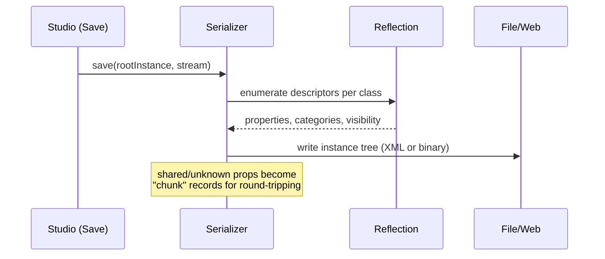

# Serialization

*Where:* `App/v8xml/`, plus `ClientShared/DataModelSerialize.cpp` /
`DataModelEmptySerialize.cpp`

Places and models are trees of `Instance`s, and they can be persisted in two flavors: **XML**
(text, human-readable) and **binary** (compact). Both are driven by the
[reflection](./instance-tree.md#the-reflection-system) descriptors.

## The serializers

| File | Format / role |
| --- | --- |
| `XmlSerializer.cpp` | XML place/model serialization (`.rbxlx` / `.rbxmx` style documents) |
| `SerializerBinary.cpp` | **Binary** serialization — the compact `.rbxl` / `.rbxm` format |
| `SerializerV2.cpp` | The V2 serializer generation of this engine era |
| `XmlElement.cpp` | XML node model used while (de)serializing |
| `WebParser.cpp` / `WebSerializer.cpp` | Parse/serialize the tree for web-service payloads |

`ClientShared/DataModelSerialize.cpp` drives whole-DataModel save/load (used for place
publish/sync), while `DataModelEmptySerialize.cpp` handles the "empty place" fast path.

## How a save works

Key properties of the format:

- **Reflection-driven** — only reflected, serializable properties are written; anything else
  is dropped or preserved as raw chunks.
- **Graph, not tree, aware** — shared references (e.g. the same mesh referenced twice) are
  deduplicated; referents (`ref=`/`id=` in the XML flavor) preserve object identity.
- **Binary compression** — the binary format compresses payloads (the engine vendors
  **lz4** in `App/lz4/`, and `Network/Compressor.cpp` reuses similar machinery for packets).

## In-repo examples of serialized content

- `BuiltInPlugins/*.rbxmx` — Studio's built-in plugins (`PhysicsAnalyzer`, `TerrainTools`,
  `TransformDragger`) are XML models; open one in a text editor to see the format.
- `PlatformContent/` and `content/` contain the runtime content, and `.rbxm`/`.rbxmx` files
  appear across `RobloxStudio/` and `RobloxTest/Scripts/` fixtures.

## Where serialization meets the network

The same Instance-to-stream machinery powers replication (`Network/Replicator.cpp` writes
property deltas), and `RCCService` serializes games when hosting them. The terrain system has
its own grid serializer (`App/voxel/Serializer.cpp`) for voxel data — see
[Terrain & CSG](./terrain-and-csg.md).
