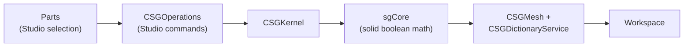

# Terrain & CSG

*Where:* `App/voxel/`, `App/voxel2/`, `CSG/`, plus `App/v8datamodel/CSGMesh.cpp`,
`CSGDictionaryService.cpp` and `RobloxStudio/CSGOperations.cpp`

Two geometry systems with "construction" in the name: **voxel terrain** (the world's
landscape) and **CSG** (solid-model boolean operations on parts).

## Voxel terrain, generation 1 — `App/voxel/`

The classic blocky terrain of early Roblox: the world is a grid of cubic **cells**.

| File | Role |
| --- | --- |
| `Cell.cpp` | A terrain cell (material + occupancy) |
| `Grid.cpp`, `Grid.Chunk.cpp` | The sparse voxel grid, chunked for scale |
| `Voxelizer.cpp` | Converts meshes/heightmaps into voxel grids |
| `Water.cpp` | Water cells — simulation & rendering inputs (waves; the fork uncapped `WaterWaveSize`/`WaterWaveSpeed`) |
| `Serializer.cpp` | Grid persistence in place files |
| `Util.cpp` | Grid helpers |

Physics integrates with terrain through cell contacts (`App/v8world/CellContact.cpp`,
`BallCellContact.cpp` — see [Physics](./physics.md)).

## Voxel terrain, generation 2 — `App/voxel2/`

The 2015-era **smooth terrain**: voxels with materials and marching-cubes-style meshing.

| File | Role |
| --- | --- |
| `Grid.cpp` | The gen-2 grid (occupancy + material per cell) |
| `MaterialTable.cpp` | Terrain materials (grass, rock, water, snow…) |
| `Mesher.cpp` | Generates the smooth render/collision meshes from the grid |
| `Conversion.h`, `BitSerializer.h`, `GridListener.h` | Grid conversion, compact persistence, change listeners |

The Studio **Terrain Tools** plugin (`BuiltInPlugins/terrain/`, `TerrainTools.rbxmx`) edits
these grids interactively.

## CSG — constructive solid geometry (`CSG/`)

Boolean operations (union/subtract/intersect) on parts:

- **`CSGKernel.cpp` / `CSGKernel.h`** — the engine-facing kernel API: takes parts in, produces
  `CSGMesh` results that live in the DataModel (rendered via `FileMesh`-style paths).
- **`sgCore/`** — the vendored **sgCore** solid-geometry library doing the heavy math.
- **`RobloxStudio/CSGOperations.cpp`** — Studio-side commands (the *Union* / *Subtract* /
  *Negate* buttons of the era).
- **`CSGDictionaryService.cpp`** (`App/v8datamodel/`) — deduplicates/stores CSG results so
  repeated operations don't balloon place files.

## Roadmap notes

Planned work in this area: mesh format version 3.00 support, water/fluid simulation, and
enhanced particle systems — see [Roadmap](../reference/roadmap.md).
