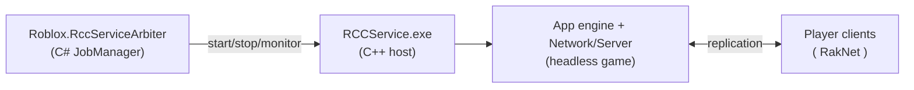

# RCCService — game hosting

**Paths:** `RCCService/`, `Roblox.RccServiceArbiter/`, `RCCService.Test/`,
`RCCService.Thumb.Test/`, `RCCService.PrepForUpload/`, `RCCServiceArbiter.PrepForUpload/` ·
**Status:** RCCService ✅ builds

**RCC** stands for *Roblox Cloud Compute*. `RCCService` is the Windows service that ran (and
here: can run) on server machines to host games **headlessly** — no UI, one process per game
(or several), exposing a SOAP/HTTP management surface that the real Roblox backend used to
start/stop/query game instances.

## `RCCService/` (C++ service)

| File | Role |
| --- | --- |
| `RCCService.cpp` | Service entry & game instance management |
| `DummyWindow.cpp/.h` | Hidden window for message-pump based plumbing |
| `OperationalSecurity.cpp/.h` | Hardening of the host (least privilege, lockdown) |
| `Message.mc` + `MSG00001.bin` | Windows Event Log message catalog |
| `RCCService.rc`, `AppSettings.xml` | Resources & service settings |
| `RCCService.sln/.vcxproj` | Its own solution (it can be built standalone) |

## `Roblox.RccServiceArbiter/` (C#)

The **arbiter** — a supervisor that manages RCC instances: `JobManager.cs`, `ArbiterInstaller.cs`,
`IArbiter.cs`, `IRccServiceArbiter.cs`, `Program.cs`, `Log.cs`. In production it sat between
the Roblox website backend and fleets of RCC services.

## Tests

- **`RCCService.Test/`** — a C# test rig: `AutoRCCTest.cs`, `BasicScenarios.cs`,
  `ServerClientTests.cs`, `StressTests.cs`/`StressSoapTest.cs`, `LuaScripts.cs`,
  `RobloxTestRigClient.cs`, plus `TestRBXLFiles/` place fixtures.
- **`RCCService.Thumb.Test/`** — thumbnail-rendering tests (RCC also rendered avatar/place
  thumbnails).
- **`RCCService.PrepForUpload/`, `RCCServiceArbiter.PrepForUpload/`** — release packaging.

## Running locally

An RCC instance plus `Network`'s server stack is how you get a *local dedicated server* to
join with a built client — see [Networking](../architecture/network.md) for the protocol and
[Clients](./clients.md) for the player side.
